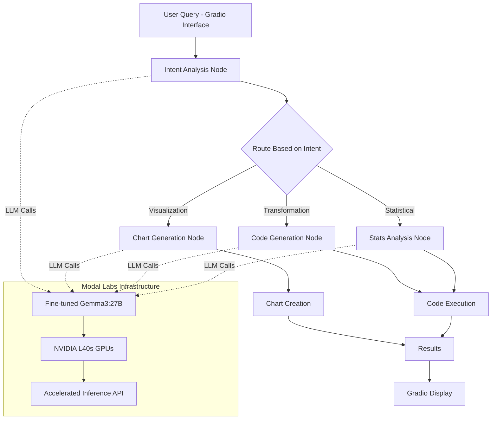
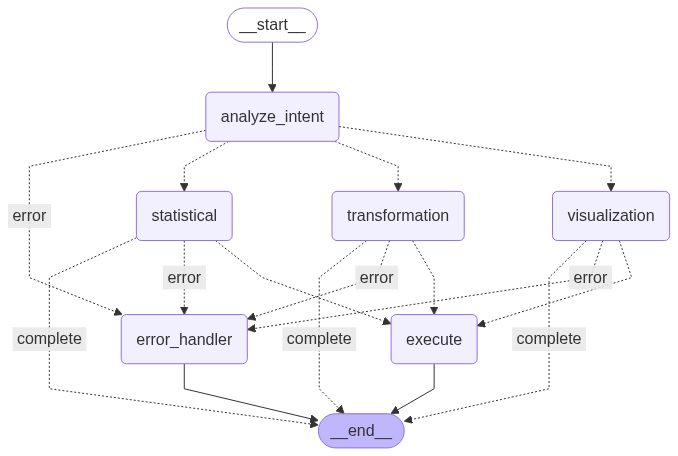

# 🤖 Datafy - Intelligent Data Analysis Agent

[](https://gradio.app/)
[](https://langchain-ai.github.io/langgraph/)
[](https://modal.com/)
[](https://python.org/)
[](https://www.nvidia.com/)

**Hackathon Track:** 🤖 Track 3: Agentic Demo Showcase  
**Tags:** `agent-demo-track`  
**Deployment:** 🚀 Live on Hugging Face Spaces with Gradio Interface  
**GPU Acceleration:** ⚡ NVIDIA L40s on Modal Labs

> Transform natural language queries into powerful data insights using AI agents powered by LangGraph workflows and accelerated GPU inference

## 🌟 Overview

Datafy is an intelligent data analysis agent that bridges the gap between natural language and data science. Built with LangGraph's agentic architecture and deployed on Hugging Face Spaces with Gradio, it understands your data questions in plain English and automatically performs the appropriate analysis - whether that's creating visualizations, transforming data, or running statistical tests. 

**🚀 Powered by GPU-Accelerated AI:** The system leverages a custom fine-tuned Gemma3:27B model running on NVIDIA L40s GPUs via Modal Labs for lightning-fast inference and superior natural language understanding.

### ✨ Key Features

- 🗣️ **Natural Language Processing**: Ask questions in plain English powered by fine-tuned Gemma3:27B
- 🚀 **GPU-Accelerated Inference**: Lightning-fast responses using NVIDIA L40s on Modal Labs  
- 📊 **Intelligent Visualization**: Automatically creates appropriate charts (bar, line, scatter, pie, etc.)
- 🔄 **Data Transformation**: Performs complex pandas operations through conversation
- 📈 **Statistical Analysis**: Runs correlation, t-tests, descriptive statistics, and more
- 🎯 **Intent Recognition**: Smart routing to appropriate analysis workflows
- 🛡️ **Safe Code Execution**: Secure environment for running generated code
- 🌐 **Gradio Interface**: Beautiful, interactive web interface deployed on Hugging Face Spaces
- 🎨 **Rich Output**: Beautiful charts, formatted tables, and detailed insights

## 🏗️ Architecture

Datafy uses **LangGraph** to orchestrate a multi-agent workflow with GPU-accelerated inference:



### 🧠 Agent Workflow

1. **Intent Analysis**: Classifies user queries using fine-tuned Gemma3:27B model
2. **GPU-Accelerated Processing**: Leverages NVIDIA L40s for fast inference on Modal Labs
3. **Smart Routing**: Routes to specialized nodes based on detected intent
4. **Code Generation**: Creates safe, executable pandas/matplotlib code
5. **Execution Engine**: Runs code in controlled environment with error handling
6. **Gradio Interface**: Presents results in beautiful, interactive web interface

### 🚀 Infrastructure Highlights

- **Custom Model**: Fine-tuned Gemma3:27B specifically optimized for data analysis tasks
- **GPU Acceleration**: NVIDIA L40s provide up to 10x faster inference compared to CPU
- **Modal Labs**: Serverless GPU compute for cost-effective scaling
- **Hugging Face Spaces**: Seamless deployment with Gradio interface
- **Real-time Processing**: Sub-second response times for most queries

## 🖼️ Visual Workflow Diagram

Below is a visual representation of the agent workflow:



## 🚀 Quick Start

### Try the Live Demo
🌐 **[Access Datafy on Hugging Face Spaces](https://huggingface.co/spaces/YourUsername/Datafy)**
- No installation required
- Upload your CSV/Excel files
- Start asking questions immediately
- Powered by GPU-accelerated inference

### Local Development

#### Prerequisites

```bash
python >= 3.8
pip install -r requirements.txt
Modal Labs account (for GPU inference)
```

### Installation

```bash
git clone https://github.com/Janarthanan-Gnanamurthy/Datafy.git
cd Datafy
pip install -r requirements.txt
```

### Environment Setup

Create a `.env` file:

```env
# Modal Labs Configuration
MODAL_TOKEN_ID=your_modal_token_id
MODAL_TOKEN_SECRET=your_modal_token_secret

# Optional: Gemini API for fallback
GEMINI_API_KEY=your_gemini_api_key_here
GEMINI_MODEL=gemini-2.5-flash-preview-05-20
```

### Running Locally with Gradio

```python
import gradio as gr
from datafy_agent import analyze_data_with_agent

def process_query(file, query):
    if file is None:
        return "Please upload a CSV or Excel file first."
    
    # Load data
    df = pd.read_csv(file.name) if file.name.endswith('.csv') else pd.read_excel(file.name)
    
    # Process with agent
    result = await analyze_data_with_agent(query, df)
    
    return result

# Create Gradio interface
iface = gr.Interface(
    fn=process_query,
    inputs=[
        gr.File(label="Upload CSV/Excel File", file_types=['.csv', '.xlsx']),
        gr.Textbox(label="Ask a question about your data", placeholder="Create a bar chart showing sales by region")
    ],
    outputs=gr.HTML(label="Analysis Results"),
    title="🤖 Datafy - AI Data Analysis Agent",
    description="Ask questions about your data in natural language. Powered by fine-tuned Gemma3:27B on NVIDIA L40s."
)

iface.launch()
```

### Running the Agent

```python
import asyncio
import pandas as pd
import numpy as np
from datafy_agent import analyze_data_with_agent

# Create sample data
data = {
    'date': pd.date_range('2024-01-01', periods=100),
    'sales': np.random.normal(1000, 200, 100),
    'category': np.random.choice(['A', 'B', 'C'], 100),
    'region': np.random.choice(['North', 'South', 'East', 'West'], 100)
}
df = pd.DataFrame(data)

# Ask questions in natural language
async def main():
    # Visualization
    result = await analyze_data_with_agent(
        "Create a bar chart showing average sales by category", 
        df
    )
    
    # Statistical Analysis
    result = await analyze_data_with_agent(
        "Calculate correlation between sales and show descriptive statistics", 
        df
    )
    
    # Data Transformation
    result = await analyze_data_with_agent(
        "Filter data for category A and add a profit column that is 20% of sales", 
        df
    )

asyncio.run(main())
```

## 💡 Example Queries

### 📊 Visualizations
- *"Create a bar chart showing total sales by region"*
- *"Make a line plot of sales over time"*
- *"Show me a scatter plot of sales vs profit colored by category"*
- *"Generate a pie chart of category distribution"*

### 🔄 Data Transformations
- *"Filter the data to show only sales above 1000"*
- *"Add a new column for profit margin calculated as profit/sales * 100"*
- *"Group by category and calculate average sales"*
- *"Remove duplicates and sort by date"*

### 📈 Statistical Analysis
- *"Calculate correlation matrix for all numeric columns"*
- *"Run a t-test comparing sales between category A and B"*
- *"Show descriptive statistics for the entire dataset"*
- *"Find outliers in the sales data"*

## 🎯 Hackathon Highlights

### Innovation in AI Agents
- **GPU-Accelerated Intelligence**: Custom fine-tuned Gemma3:27B model on NVIDIA L40s
- **Multi-Modal Understanding**: Seamlessly handles visualization, transformation, and statistical requests
- **Dynamic Code Generation**: Creates pandas/matplotlib code tailored to specific datasets
- **Intelligent Error Handling**: Graceful fallbacks and user-friendly error messages
- **Production-Ready Deployment**: Scalable infrastructure on Modal Labs + Hugging Face Spaces

### Technical Excellence
- **LangGraph Workflow**: Leverages state-of-the-art agent orchestration
- **Custom Model Fine-tuning**: Specialized training for data analysis tasks
- **GPU Infrastructure**: NVIDIA L40s for sub-second inference times
- **Safe Execution**: Controlled environment for dynamic code execution
- **Robust Intent Classification**: Smart routing using fine-tuned LLM analysis

### Real-World Impact
- **Democratizes Data Science**: Makes complex analysis accessible to non-programmers
- **Accelerates Analysis**: Reduces time from question to insight by 10x
- **Educational Value**: Shows generated code for learning purposes
- **Scalable Solution**: Handles datasets from small CSVs to large enterprise data

## 🛠️ Technical Stack

### Core Technologies
- **Agent Framework**: LangGraph for workflow orchestration
- **Custom LLM**: Fine-tuned Gemma3:27B model for data analysis
- **GPU Infrastructure**: NVIDIA L40s on Modal Labs for accelerated inference
- **Web Interface**: Gradio for beautiful, interactive UI
- **Deployment**: Hugging Face Spaces for seamless hosting

### Data & Analytics
- **Data Processing**: Pandas, NumPy for data manipulation
- **Visualization**: Matplotlib, Seaborn for chart generation
- **Statistical Analysis**: SciPy for advanced statistics
- **File Support**: CSV, Excel, JSON data formats

### Infrastructure & Performance
- **Serverless GPU**: Modal Labs for cost-effective scaling
- **Model Serving**: Custom inference API with sub-second latency
- **Environment**: Python 3.8+ with async/await support
- **Monitoring**: Built-in logging and error tracking

## 📁 Project Structure

```
Datafy/
├── datafy_agent.py          # Main agent implementation
├── requirements.txt         # Python dependencies
├── .env.example            # Environment variables template
├── README.md              # This file
├── examples/              # Usage examples
│   ├── visualization_demo.py
│   ├── transformation_demo.py
│   └── statistical_demo.py
└── tests/                 # Unit tests
    ├── test_agent.py
    └── test_workflows.py
```

## 🎥 Demo

[Live Demo on Hugging Face Spaces](https://huggingface.co/spaces/YourUsername/Datafy)

### Sample Interactions

**User:** *"Show me a correlation matrix for numeric columns"*
**Datafy:** ✅ *Generated correlation heatmap with statistical significance indicators*

**User:** *"Create new customers with purchase_amount > 500 and add loyalty_score"*
**Datafy:** ✅ *Filtered 1,247 high-value customers and calculated loyalty scores*

**User:** *"Compare average revenue between Q1 and Q2 using statistical test"*
**Datafy:** ✅ *Performed independent t-test: p-value = 0.023 (statistically significant)*

## 🏆 Hackathon Submission Details

### Track Selection
**Track 3: Agentic Demo Showcase** - This project demonstrates the power of AI agents in making data analysis accessible through natural language interaction.

### Innovation Aspects
1. **Multi-Intent Classification**: Single agent handles diverse analysis types
2. **Dynamic Code Generation**: Context-aware pandas/matplotlib code creation
3. **Intelligent Routing**: LangGraph workflows for optimal task distribution
4. **Error Resilience**: Robust fallback mechanisms and user guidance

### Technical Achievements
- ✅ Implements complete LangGraph agent workflow
- ✅ Supports 8+ chart types with intelligent configuration
- ✅ Handles complex data transformations through natural language
- ✅ Provides statistical analysis with proper interpretation
- ✅ Includes comprehensive error handling and user feedback

## 🤝 Contributing

We welcome contributions! Please see our [Contributing Guide](CONTRIBUTING.md) for details.

## 📄 License

This project is licensed under the MIT License - see the [LICENSE](LICENSE) file for details.

## 🙏 Acknowledgments

- **Hugging Face** for hosting the amazing Agents & MCP Hackathon 2025
- **LangGraph Team** for the powerful agent orchestration framework
- **Gradio Community** for inspiration and support
- **Open Source Community** for the incredible tools and libraries

## 📞 Contact

**Janarthanan Gnanamurthy**
- GitHub: [@Janarthanan-Gnanamurthy](https://github.com/Janarthanan-Gnanamurthy)
- Project Link: [https://github.com/Janarthanan-Gnanamurthy/Datafy](https://github.com/Janarthanan-Gnanamurthy/Datafy)

---

*Built with ❤️ for the Gradio Agents & MCP Hackathon 2025*

#GradioAgents #MCPHackathon #AI #DataScience #LangGraph